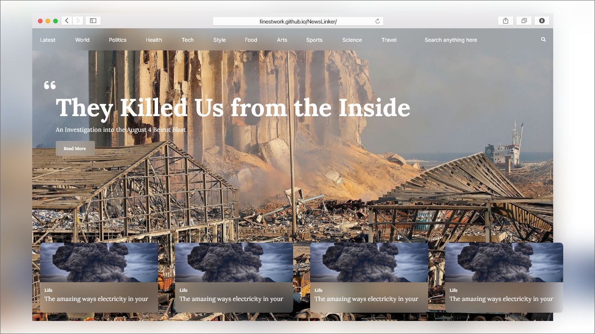

# Introduction
NewsLinker is a news aggregator that redirects users to the original articles, providing a
convenient and centralized way to discover and read the latest news.

## Important Notice
Just want to let you know that the app is hosted on a static site hosting service, so you may experience some limitations while using it. For instance, you can navigate to different categories, and you will be redirected to the corresponding path like this: `/category/:categoryId`, but once you hit the address bar again, it will give you a 404 error page.

Please keep in mind that this app is primarily meant for demonstration purposes, and we appreciate your understanding.

Also, New York Times API has a **rate limit** of 10 requests per minute.

# Browser Support
- Chrome 76+
- Edge 17+
- Safari 9+
- Firefox 103+
- Opera 64+

# Special Thanks To
- [LogoIpsum](https://logoipsum.com/)
- [New York Times API](https://developer.nytimes.com/)
